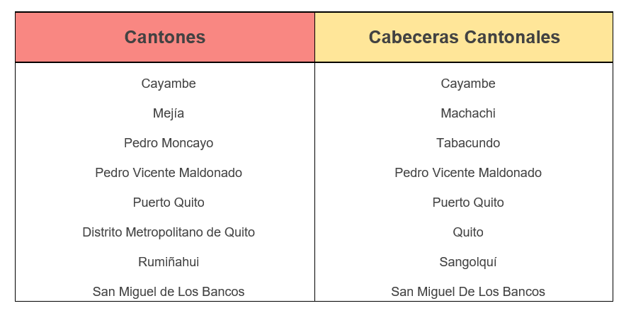
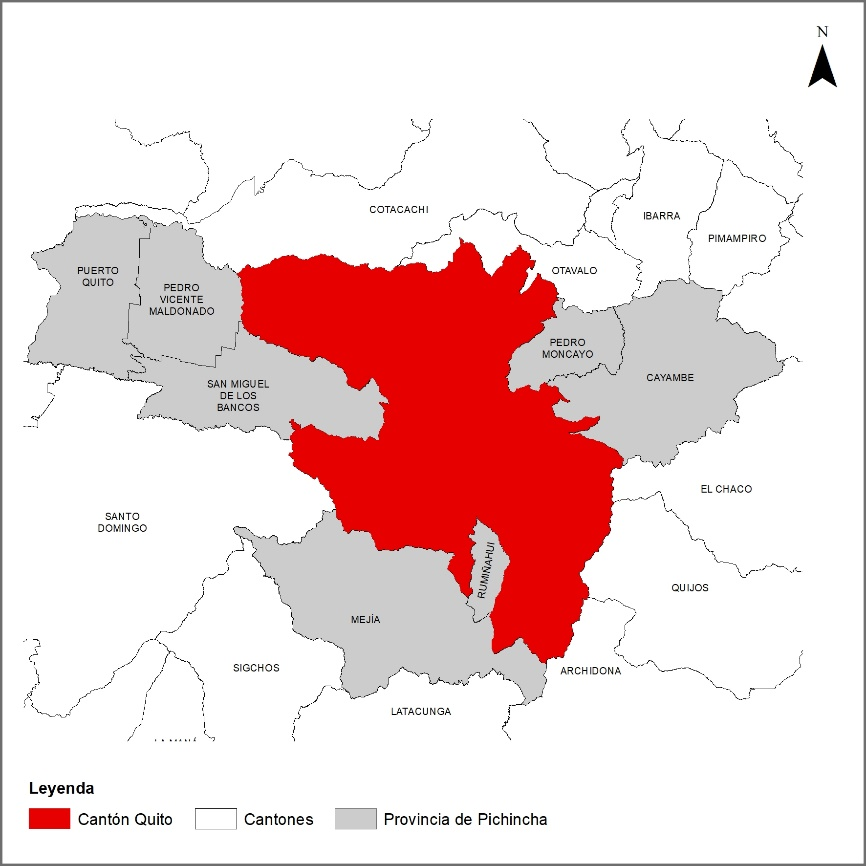
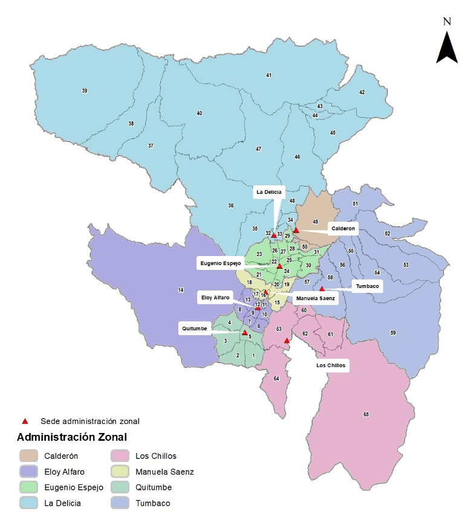
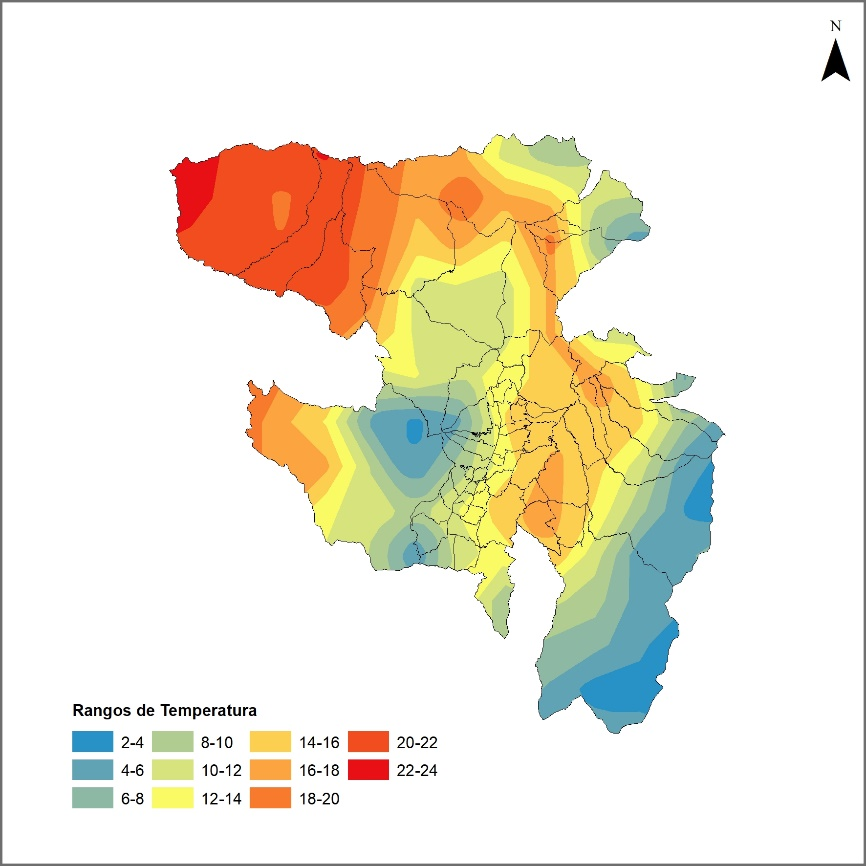
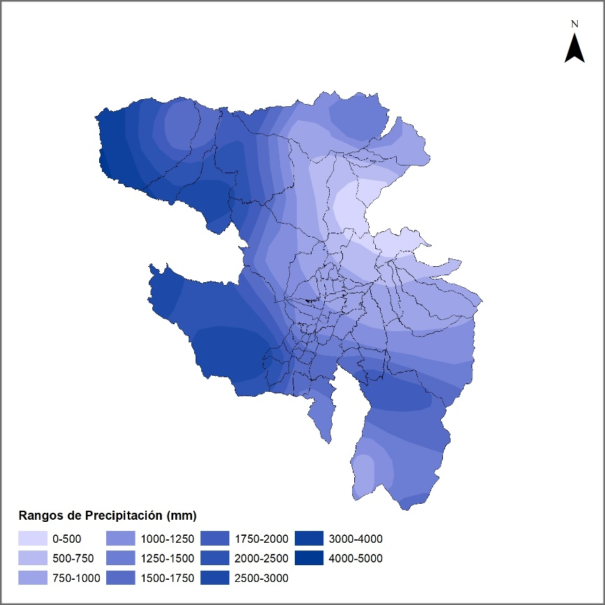

# Quito y su Territorio

La Provincia de Pichincha es una de las 24 provincias que conforman la República del Ecuador, se encuentra ubicada al norte del país, en la región geográfica conocida como Sierra, además registra una altitud de 2.816 m.s.n.m. La provincia limita al norte con Imbabura y Esmeraldas, al sur con Cotopaxi, al este con Sucumbíos y Napo y finalmente al oeste con Santo Domingo de los Tsáchilas.

Por otro lado, la Provincia de Pichincha registra una población de 2´576.287 (dato tomado del censo de población y vivienda realizado en 2010) y posee una extensión territorial de 9.612 km2 donde se distribuyen los siguientes cantones con sus respectivas cabezas cantonales mencionados en el siguiente cuadro:

{width="460"}

En cuanto a su administración, la provincia alberga a la Ciudad de Quito (ciudad fundada el 6 de diciembre de 1534), la capital del Ecuador, actualmente es administrada por el Gobierno Autónomo Descentralizado de la Provincia de Pichincha, desde su capital Quito.

De acuerdo con la Organización de las Ciudades del Patrimonio Mundial, Quito es la primera ciudad declarada por la UNESCO Patrimonio Cultural de la Humanidad. Quito es el epicentro político, económico, administrativo, artístico, deportivo y cultural de Ecuador.

## Ubicación Distrito Metropolitano de Quito

La ciudad de Quito es la segunda ciudad capital más alta del mundo con 2830 msnm. y cuenta con una superficie de 4.235,2 km2. El Distrito Metropolitano de Quito se ha desarrollado en el eje norte-sur (actualmente tiene más de 80 km de largo y 5 km de ancho) contando con una proyección poblacional aproximada para el año 2022 de 2.822262 millones de habitantes.

Se situada en la cordillera de los Andes, rodeada de doce volcanes, entre ellos el Pichincha, Cotopaxi, Antisana, Cayambe. Además, la ciudad se encuentra delimitada al norte por el volcán Casitagua, al este por la falla geológica EC-31 (conocida como Falla de Quito-Ilumbisi o Falla de Quito), al oeste por las faldas orientales del Pichincha y al sur por el Volcán Atacazo.

## Delimitación Política Administrativa

La ciudad de Quito limita al norte con la provincia de Imbabura, al sur con los cantones Rumiñahui y Mejía, al este con los cantones Pedro Moncayo, Cayambe y provincia del Napo y al oeste con los cantones Pedro Vicente Maldonado, Los Bancos y provincia de Santo Domingo de los Tsáchilas, representados en el siguiente mapa:

{width="460"}

A nivel político administrativo, la ciudad está dividida en 65 parroquias, de las cuales 32 son urbanas y 33 corresponden a parroquias rurales. Adicionalmente, se divide en nueve zonas administrativas, detalladas a continuación en la siguiente tabla:

A continuación, se puede observar la distribución política administrativa a nivel parroquial según su administración zonal:

{width="460"}

## Clima

Por su parte, Quito es conocido por su clima variable, con temperaturas que varían de entre los 25 grados centígrados de día hasta los 10 grados en la noche, la ciudad es conocida porque en un mismo día se pueden combinar fuertes lluvias, temperaturas bajas y soles brillantes. A pesar de que el clima de Quito se distingue en temporada seca (que va desde mayo hasta septiembre) y lluviosa (de octubre a diciembre), un día puede albergar las condiciones climáticas de ambas temporadas.

La temperatura de la ciudad de Quito, registra un promedio de 11.7 °C, donde las entidades encargadas del manejo de datos como el INAMHI, la Secretaría del Ambiente y el Ministerio del Ambiente, Agua y Transición del Ecuador (MAATE) registran que agosto es el mes más cálido. En contraste, las temperaturas medias más bajas del año se producen en el mes de noviembre, marcando una temperatura de alrededor de 11.1 °C. Cabe mencionar que, de acuerdo con los datos históricos del tiempo de Quito, la variación en las temperaturas durante todo el año es 0.6 °C.

En el siguiente mapa se pueden observar los rangos de temperatura (grados centígrados) promedio del Distrito Metropolitano de Quito:

{width="460"}

La entidad encargada de registrar el tiempo y clima para el Distrito Metropolitano de Quito y el Ecuador es el Instituto Nacional de Meteorología e Hidrología (INAMHI), el cual maneja los datos de las estaciones meteorológicas siendo las más importantes para el DMQ Amaguaña, Cotogchoa, Machachi, Alóag, Tambillo, Chillogallo y Cutuglagua.

## Precipitaciones

En cuanto al clima, de acuerdo con la clasificación climática de Köppen-Geiger, la Provincia de Pichincha posee un clima clasificado como Cfb (Marítimo de costa occidental (oceánico)) el cual le da a la ciudad de Quito un clima templado de veranos frescos, con precipitaciones abundantes y bien repartidas durante todo el año. En Quito, la temperatura media anual es de 11.3 °C. y las precipitaciones registran promedios de 2877 mm. Se menciona además que el mes más seco es julio ya que los registros del INAMHI arrojan que la cuidad presenta 116 mm de precipitación en julio y por contraparte, la mayor cantidad de precipitación ocurre en marzo, con un promedio de 315 mm. Siendo el mes más lluvioso.

En el mapa a continuación se muestran los rangos de precipitación promedio (en mm) del Distrito Metropolitano de Quito:

{width="460"}

## Pisos Altitudinales

En cuanto al piso altitudinal, la ciudad de Quito, se encuentra entre los 2000 y 3000 metros de altura sobre el nivel del mar abarcando desde los valles hasta los puntos más altos de la urbe, de esta manera la ciudad encaja en un clima entre templado y frío que se caracteriza por vientos frecuentes en época lluviosa templada y en época seca con vientos fuertes, aire seco y cálido. De acuerdo con el Sistema Nacional de Información (SNI), el piso climático de la ciudad corresponde en concreto al Piso Templado Interandino y al Piso Subtropical Interandino, en este último además se identifica como Ecosistema Natural de la Región Andina a los valles interandinos.

Debido a estas condiciones es que la temperatura media anual se encuentra alrededor de los 12°C, por lo que el ambiente es cómodo para el asentamiento urbano y el desarrollo de la ciudad de Quito.

## Cap
